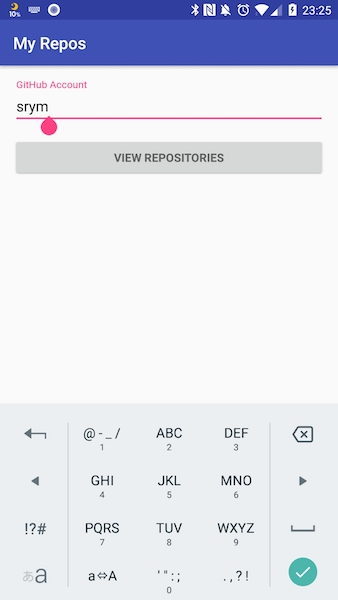
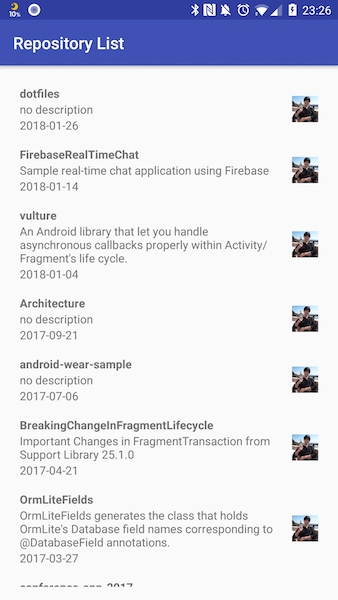

# DroidKaigi 2018 - Android Unit Testing Hands-On

本レポジトリは [DroidKaigi 2018](https://droidkaigi.jp/2018/) の「[はじめてのUnit Test](https://droidkaigi.jp/2018/timetable?session=16942)」のハンズオン課題です。

# 資料

本課題に際して事前に行う座学の資料です。課題に取り組む際にも適宜参照してください。

[Unit Testing in a Nutshell - DroidKaigi 2018](https://speakerdeck.com/srym/unit-testing-in-a-nutshell-droidkaigi-2018)

[Kotlin でテストを書く](https://speakerdeck.com/numa08/kotlin-detesutowoshu-ku)

# 課題

本レポジトリをcloneしたらAndroid Studioで開いて実際にUnit Testを書いていきます。

すべてのソースコードとテストコードは `app` モジュール以下に含まれています。

参考までに、アプリケーションコードは次のディレクトリから、

`./app/src/main/java/us/shiroyama/android`

テストコードは次のディレクトリからそれぞれ参照することができます。

`./app/src/test/java/us/shiroyama/android`

便宜上、前者を `${APP_ROOT}`, 後者を `${TEST_ROOT}` と表記します。

初期状態では `tasks` ブランチがチェックアウトされています。

`master` ブランチに切り替えることで、いつでも実装済みのテストコードを参照することができます。

作業に行き詰まった際には適宜ブランチを切り替えて中身を確認してみてください。Enjoy!!

## ウォーミングアップ

はじめてUnit Testを書く人向けの課題です。

`${APP_ROOT}/hands_on_beginners` と `${TEST_ROOT}/hands_on_beginners` でコードを参照することができます。

### 1. はじめてのアサーション

はじめてのアサーションを書いてみましょう。

`${TEST_ROOT}/hands_on_beginners/Sandbox.java`

を開き、コメントを読みながら数字や文字列を使った簡単なアサーションを体験してみてください。

### 2. はじめてのUnit Test

シンプルなクラスのUnit Testに挑戦してみましょう。

`${APP_ROOT}/hands_on_beginners/InputChecker.java`

これは入力文字列が有効かどうかを調べるシンプルなチェッカーです。

`${TEST_ROOT}/hands_on_beginners/InputCheckerTest.java`

を開き、コメントを読みながら、様々な入力に対応するテストケースを完成させてください。

### 3. Robolectricを使ったUnit Test

Androidフレームワークのコードを使ったシンプルなクラスのUnit Testに挑戦してみましょう。

`${APP_ROOT}/hands_on_beginners/BetterInputChecker.java`

このクラスには `android.text.TextUtil` が使われているので `Robolectric` を使う必要があります。

`${TEST_ROOT}/hands_on_beginners/BetterInputCheckerTest.java`

を開き、コメントを読みながらテストケースを完成させてください。

### 4. Listのアサーション

Listを返すメソッドのUnit Testを通じて、Listに使える様々なアサーションを試してみましょう。

`${APP_ROOT}/hands_on_beginners/mockito/converter/TweetConverter.java`

このクラスは `Tweet` クラスを `String` に変換するシンプルなコンバータです。

`${TEST_ROOT}/hands_on_beginners/mockito/converter/TweetConverterTest.java`

を開き、コメントを読みながらテストケースを完成させてください。

ヒントを参考にしながらListを検証するための様々なアサーションにチャレンジしてみましょう。

### 5. Mockitoを使ったStubbing

結果が不定であったり、データベースやネットワーク通信に依存しているせいでUnit Testが書きづらいクラスがあります。
そういう場合はMockitoを使ったStubbingでメソッドの返り値をモックしてみましょう。

`${APP_ROOT}/hands_on_beginners/mockito/repository/TweetRepository.java`

このクラスは `Tweet` クラスをローカルデータベースから読み出して返すレポジトリです。

`${TEST_ROOT}/hands_on_beginners/mockito/repository/TweetRepositoryTest.java`

を開き、コメントを読みながらテストケースを完成させてください。

### 6. Mockitoを使ったSpying

`Mockito#mock` を使ったStubbingが完全なハリボテを作るのに対し、元のオブジェクトの一部機能だけを書き換えたい場合に `Mockito#spy` をつかったSpyingが有効です。

`${APP_ROOT}/hands_on_beginners/mockito/repository/TweetRepositoryWithConverter.java`

このクラスは前出の `TweetRepository` に似ていますが `Tweet` の本文だけを抜き出して集めるためにコンバータを利用します。
Spyingを利用して、内部でこの変換メソッドが呼ばれていることを検証するのにチャレンジしてみましょう。

`${TEST_ROOT}/hands_on_beginners/mockito/repository/TweetRepositoryWithConverterTest.java`

を開き、コメントを読みながらテストケースを完成させてください。

### 7. 非同期処理のUnit Test

一般に非同期処理のUnit Testは簡単ではありません。
非同期処理が別スレッドで開始されて何か重い処理を行っている間に、テストを実行しているスレッドがテストケースを抜けてしまうと、そのテストは成功とみなされます。

`${APP_ROOT}/hands_on_beginners/async/AsyncFetcher.java`

このクラスは、同期的に `T` を取得するクラス `Fetcher<T>` を非同期に実行するクラスです。
結果は `OnSuccess<T>` と `OnFailure` で受け取ります。

`${TEST_ROOT}/hands_on_beginners/async/AsyncFetcherTest.java`

を開き、コメントやヒントを見ながら非同期処理を待ち合わせてコールバックを受け取ってからアサーションするテストケースを完成させてください。

## 実践編

ここからは実際に動くアプリの各レイヤごとのUnit Testを書くことで、実践的なテクニックを身につけていきます。
題材となるアプリは本レポジトリに含まれているので、まずはエミュレータや実機で動作を確認してください。

このアプリはGitHubのアカウント名を入力するとその人のレポジトリ一覧を表示するというシンプルなアプリです。
構成は [Android-CleanArchitecture](https://github.com/android10/Android-CleanArchitecture) 等を参考に作られており、次のコンポーネントから成り立ちます。

 - Infrastructure（インフラ層）
 	- Repository（レポジトリ）
 		- Local Data Source（DB等のローカルのデータソース）
 		- Remote Data Source（API通信等のリモートのデータソース）
 - Domain（ドメイン層）
 	- UseCase（ビジネスロジック）
 	- Model（ドメインモデル）
 - Presentation（プレゼンテーション層）
 	- Presenter（Viewとビジネスロジックを結びつけるプレゼンター）
 	- View（コントローラからUIに関するものだけを切り出したビュー）

実践編ではこれらの各レイヤでテストを書く方法を学びます。

### 1. MockWebServerを使ってリモートデータソースのテストを書こう

本アプリは [Retrofit](http://square.github.io/retrofit/) を使って非同期通信を行います。
非同期通信のUnit Testは悩みのタネですが、ここでは [MockWebServer](https://github.com/square/okhttp/tree/master/mockwebserver) というローカルでHTTP通信を模してくれる便利なライブラリを利用して本番さながらの通信のテストを行います。

`${APP_ROOT}/infrastructure/repository/datasource/remote/GitHubRestDataSource.java`

このクラスはGitHub APIとHTTP通信を行い、指定したアカウント名のレポジトリ一覧を取得します。

`${TEST_ROOT}/infrastructure/repository/datasource/remote/GitHubRestDataSourceTest.java`

を開き、コメントやヒントを参考にしてAPI通信する部分や、不正な入力に対してエラーを受け取る部分を完成させてください。

### 2. RobolectricとRoomを使ってローカルデータソースのテストを書こう

本アプリは [Room Persistence Library](https://developer.android.com/topic/libraries/architecture/room.html) を使ってローカルDBにリモート通信結果をキャッシュします。
ウォームアップで使ったRobolectricを用いるとSQLiteに読み書きする部分を我々が何も考える必要なく簡単にテストすることができます。

`${APP_ROOT}/infrastructure/repository/datasource/local/room/dao/RoomRepositoryDao.java`

はローカルのSQLiteにレポジトリとユーザ情報を読み書きするためのDAOです。

`${TEST_ROOT}/infrastructure/repository/datasource/local/room/dao/RoomRepositoryDaoTest.java`

を開き、コメントやヒントを参考にしてDBの読み書き部分をテストしてみましょう。

また、`RoomRepositoryDao` を利用するローカルデータソースである

`${APP_ROOT}/infrastructure/repository/datasource/local/GitHubRoomDataSource.java`

のテストも書いてみましょう。

`${TEST_ROOT}/infrastructure/repository/datasource/local/GitHubRoomDataSourceTest.java`

にコメントしましたが、ここでも `Robolectric` を使ってDBへの読み書きまでやっても良いですが、それはすでに `RoomRepositoryDaoTest` でテストできているので、こちらはDAOのモックとMapperの `verify()` だけでも充分かもしれません。色々考えて書いてみましょう。

### 3. 各データソースを束ねたレポジトリのテストを書こう

各データソースのテストが書けたので、今度はそれを束ねるレポジトリのテストを書きましょう。

`${APP_ROOT}/infrastructure/repository/GitHubInfraRepository.java`

は、リモートデータソースとローカルデータソースの状況に応じてそれぞれからデータを取り分けるレポジトリ層です。

データソースはすべてインタフェースが切られているのでどちらもモックすれば良さそうです。

`${TEST_ROOT}/infrastructure/repository/GitHubInfraRepositoryTest.java`

を開き、コメントを見ながら各データソースで値があるかどうかでどのメソッドとはインタラクションがないのかも意識しながらすべてのパターンを網羅できるようにテストを書いてみて下さい。

### 4. ユースケースのテストを書こう

次にレポジトリ層を使うユースケース層のテストを書いてみましょう。

`${APP_ROOT}/domain/usecase/GetRepositories.java`

は、レポジトリ層からGitHubレポジトリ一覧を取得するドメイン層のユースケースです。

この層がアプリの同期処理と非同期通信の中間にいる層であり、ここでタスクを `ExecutorService` にキューイングして、結果を [Otto Event Bus](http://square.github.io/otto/) で通知します。

キューイングするのは `Runnable` のサブクラスの `Task` なので、そのままではテストが非常に書きづらい部分ですが、工夫をすることで呼び出された時の処理の流れを検証することができます。

`${TEST_ROOT}/domain/usecase/GetRepositoriesTest.java`

を開き、コメントやヒントをみながら、キューイングされたタスクが実際に処理される際に内部的に呼ばれる処理を `verify()` するようなテストを書いてみてください。

### 5. Presenterのテストを書こう

ついに最後のPresenterのテストです！

PresenterはViewのイベントを受けてビジネスロジックの実行を依頼し、結果をイベントで受け取ってViewに変更通知する役割を担うコンポーネントです。

ViewをインタフェースにしてActivity/Fragmentに実装させることで、テスト時はこれをモック可能にするところがポイントです。

`${APP_ROOT}/presentation/presenter/AccountInputPresenter.java`

`${APP_ROOT}/presentation/presenter/RepoListPresenter.java`

はそれぞれアカウント入力画面とレポジトリ一覧のPresenterです。

`${TEST_ROOT}/presentation/presenter/AccountInputPresenterTest.java`

`${TEST_ROOT}/presentation/presenter/RepoListPresenterTest.java`

を開き、コメントやヒントをみながらPresenterのメソッドが呼び出されてビジネスロジックが実行された結果、Viewにどのようなインタラクションが走るか検証するテストコードに挑戦してみてください。

## 発展編

### Kotlinを使ってアプリのテストを書く

[Androidアプリ開発のためのKotlin実践プログラミング](http://www.shuwasystem.co.jp/products/7980html/5366.html) を参考に、JavaのプロジェクトにテストコードからKotlinを取り入れてみましょう。

当日は著者の [@numa08](https://twitter.com/numa08) 氏がチューターとして参加くださいます。
何でも質問してみましょう。

### その他

参加者の習熟度や興味に応じて臨機応変に対応します。
